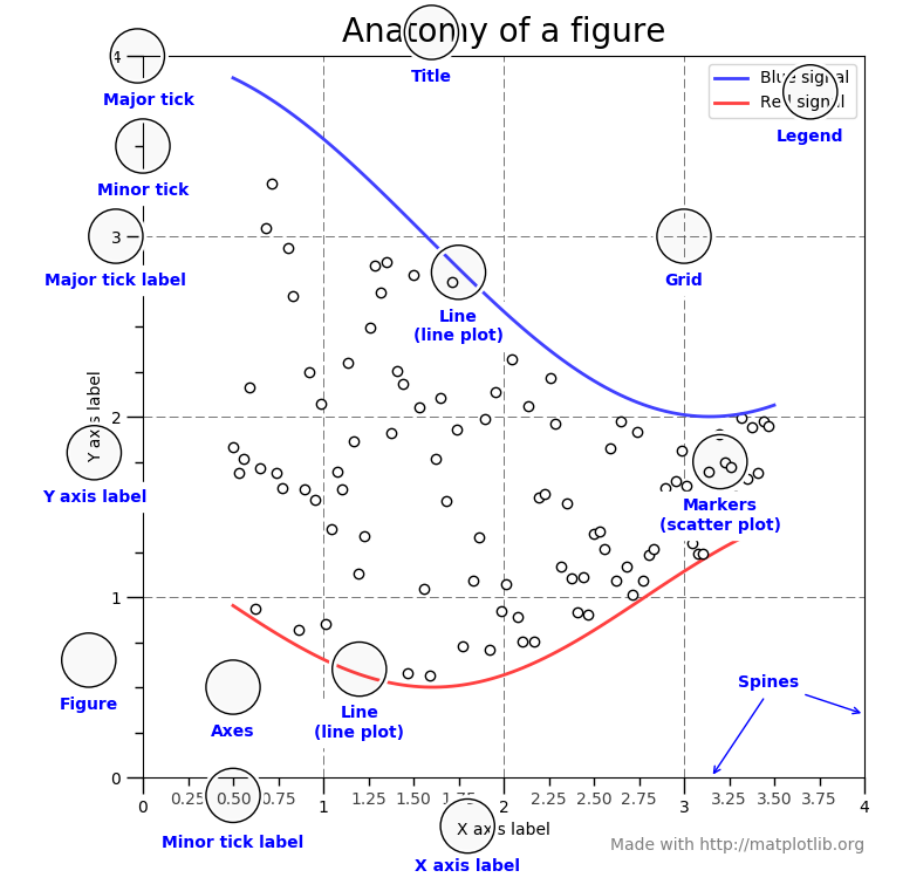
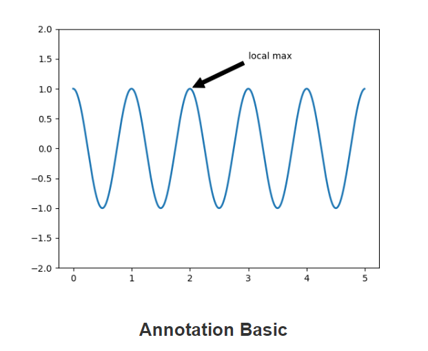
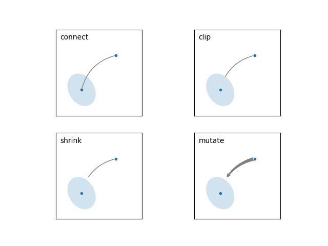
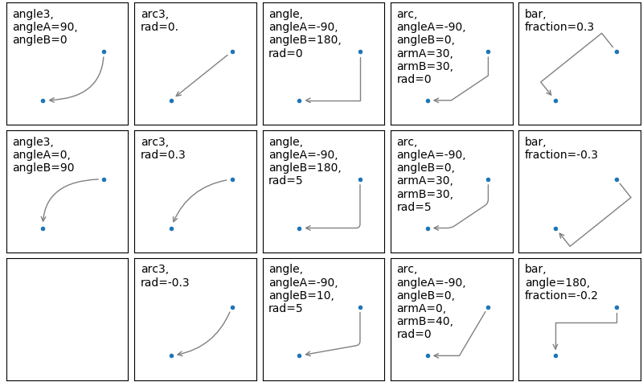
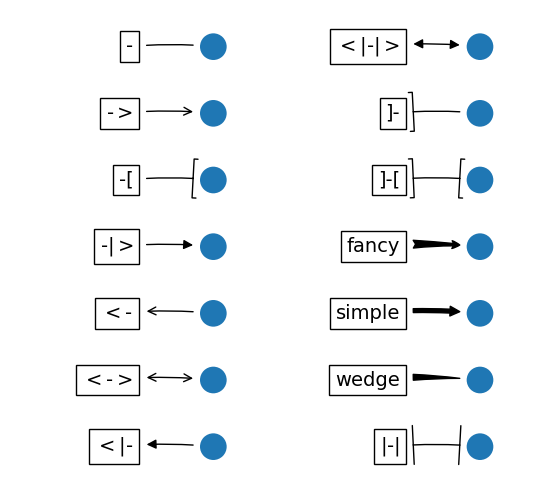
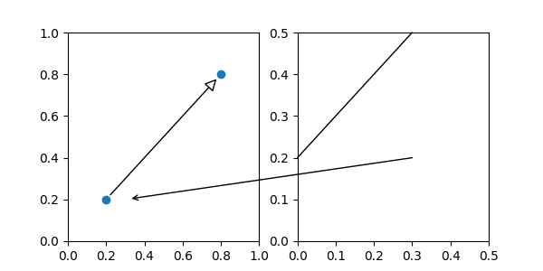
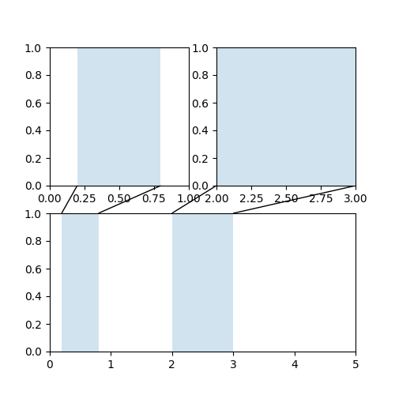

```{r setup, echo=F, purl=F}
knitr::opts_knit$set(root.dir = getwd())
knitr::opts_chunk$set(echo = TRUE, results = 'hide')
knitr::opts_chunk$set(warning = FALSE, message=FALSE)
knitr::opts_chunk$set(fig.align="center"
                      ## ,out.width="0.9\\textwidth" # latex
                      ,out.width="90%" # for both latex and html
                      ,fig.width=5, fig.height=3
                      )
```

```{r prepare, echo=F, purl=F}
rm(list=ls())
options(digits=4)
options(scipen=100)
graphics.off()
Sys.setlocale("LC_ALL", "Chinese")
library(reticulate)
```

# 简介

### Facts

1.  初始版本：2003；13年前
2.  稳定版本：稳定版本：0.18.1；2016年9月22日
3.  网址：<http://matplotlib.org>

### 什么是 matplotlib?

1.  matplotlib 是一个用 Python 生成数组二维图形的库。
2.  尽管它的起源是模仿 MATLAB 的图形命令，但它独立于 MATLAB，并且可以用
    python的、面向对象的方式使用。
3.  虽然 matplotlib 主要是用纯 Python 编写的，但是它大量使用 NumPy 和其他
    扩展代码，以便为大型数组提供良好的性能。


### 三个部分

1.  Matplotlib 代码在概念上分为三部分:

1.  Pylab 接口是由 matplotlib 提供的一组函数。
    1.   Pylab，它允许用户创建与 MATLAB 图形生成代码相当类似的图形。
    2.  一般来说，pylab 是为了将 NumPy 和 matplotlib 导入到一个类似
    MATLAB 的语法的全局名称空间中，然而一个更明确的导入风格，同时命名
    matplotlib 和 NumPy，是首选的编码风格。
2.  Matplotlib 前端或 matplotlib API 是一组类，它们担负重任，做着创
    建和管理图形、文本、线条、图形等工作。
3.  后端是设备相关的绘图设备，又称呈现程序，它将前端表示转换为硬拷贝或
    显示设备。

# 基本概念

### 两个接口

1.  matplotlib 有两个接口。
2.  第一种是基于 MATLAB 并使用基于状态的接口。 
3.  第二种是面向对象(OO)接口。
4.  在 matplotlib 绘图时，知道有两种方法是至关重要的。

## 图形组成部分

### 图形

1.  整个图形。 图形记录了所有的子坐标轴，少量的“特殊”ARTIST对象(标题，图例等) 
2.  ，以及画布。
3.  一个图形可以有任意数量的轴，但是为了能够使用，至少应该有一个轴。
4.  创建一个新图形最简单的方法是用 pyplot:

``` {python}
import matplotlib.pyplot as plt
import numpy as np

fig = plt.figure()  # an empty figure with no axes
fig.suptitle('No axes on this figure')  # Add a title so we know which it is

fig, ax_lst = plt.subplots(2, 2)  # a figure with a 2x2 grid of Axes

```

### 轴域(Axes)

1.  你所认为的“一个图” ，它是图像与数据空间的区域。
2.  一个给定的图形可以包含许多轴，但是一个给定的轴对象只能在一个图中。
3.  Axes 包含两个(3D 情况下包含三个) Axis 对象(注意 Axes 和 Axis 之间
    的区别) ，它们负责数据限制(数据限制也可以通过 set xlim ()和 set ylim 
    () Axes 方法来控制)。
4.  每个轴都有一个标题(通过 set title ()设置)、一个 x 标签(通过 set xlabel 
    ()设置)和一个通过 set ylabel ()设置的 y 标签集。
5.  Axes 类及其成员函数是使用 OO 接口的主要入口点。


### 轴(Axis)

1.  这些是类似数字行的对象。
2.  它们负责设置图形限制并生成ticks(刻度)(轴上的标记)和 ticklabel(刻度标签) 
    (标记刻度的字符串)。
3.  刻度的位置由 Locator 对象确定，刻度标签字符串由 Formatter 格式化。
4.  正确的定位器和格式化程序的组合可以很好地控制刻度位置和标签。

### Artist对象

1.  基本上在图形中你能看到的所有东西都是artist对象 (甚至是图形、轴域和轴对象)。
2.  这包括 Text 对象、 Line2D 对象、集合对象、补丁对象... (你了解了吗)。
3.  当图被描绘时，所有的artist 都被画在画布上。
4.  大多数 artist 都被绑在一个 axes 上，这样的 artist 不能被多个轴共享，
    也不能从一个轴移动到另一个轴。

### 其他组成部分



### 绘图函数的输入类型

1.  所有的绘图函数期待以np.array 或 np.ma.masked_array输入。
2.  例如pandas数据对象和 np.matrix 的“类似数组”的类可能正常工作，也可能不正常工
    作。
3.  最好在绘图之前将它们转换为 np.array 对象。

``` {python}
import matplotlib.pyplot as plt
import numpy as np
import pandas as pd

a = pd.DataFrame(np.random.rand(4,5), columns = list('abcde'))
a_asarray = a.values

b = np.matrix([[1,2],[3,4]])
b_asarray = np.asarray(b)
```

### Matplotlib, pyplot and pylab: 它们是如何关联的？

1.  Matplotlib是整个包
2.  matplotlib.pyplot是Matplotlib里的一个模块。
3.  Pylab 是一个方便的模块，它在一个名称空间中批量导入 matplotlib.pyplot 
    (用于绘图)和 numpy (用于数学和使用数组)。 Pylab 已被否决，并且由于名称
    空间的污染，它的使用受到强烈反对。 使用 pyplot 代替

### pyplot

1.  对于 pyplot 模块中的函数，总是有一个“当前”图形和轴(根据请求自动创建)。
2.  例如，在下面的示例中，对 plt.plot 的第一个调用创建轴。
3.  随后对 plt.plot 的后续调用，在相同的轴上添加额外的行
4.  plt.xlabel、 plt.ylabel、 plt.title 和 plt.legend 设置轴的标签和标题
    并添加图例。

``` {python}
x = np.linspace(0, 2, 100)

plt.plot(x, x, label='linear')
plt.plot(x, x**2, label='quadratic')
plt.plot(x, x**3, label='cubic')

plt.xlabel('x label')
plt.ylabel('y label')
plt.title("Simple Plot")
plt.legend()

plt.show()

```

## 后端

### 什么是后端？

1.  Matplotlib 针对许多不同的用例和输出格式。
2.  为了支持所有这些用例，matplotlib 可以针对不同的输出，每个功能都称为后端; 
3.  前端”是面向用户的代码，即绘图代码，而“后端”完成所有在幕后制作图形的艰苦工作。
4.  有两种类型的后端:
    1.  用户界面后端(用于 pygtk、 wxpython、 tkinter、 qt4或 macosx; 也称
        为“交互式后端”)
    2.  硬拷贝后端(PNG、 SVG、 PDF、 PS; 也称为“非交互式后端”)。

### 配置后端

1.  Matplotlibrc 文件中的后端参数
2.  如果你的脚本依赖于特定的后端，则可以使用 use ()函数。
3.  如果使用 use ()函数，则必须在导入 matplotlib.pyplot 之前完成。 在引入 
    pyplot 之后调用 use ()将不起作用。
4.  如果用户希望使用不同的后端，那么使用 use ()将需要对代码进行更改。

``` {python}
import matplotlib
matplotlib.use('pdf')   ### generate postscript output by default

```

### 什么是交互模式？

1.  使用交互式后端可以在屏幕上绘图。
2.  交互模式也可以通过 `matplotlib.pyplot.ion ()`打开
3.  通过  `matplotlib.pyplot.ioff()`关闭。
4.  非交互式例子::

``` {python}
import matplotlib.pyplot as plt
plt.ioff()
plt.plot([1.6, 2.7])

```

1.  什么都没有发生，或者至少屏幕上什么都没有显示出来，为了让绘图显示出来，
    你需要这样做:

``` {python}
plt.show()
```

1.  现在您看到了绘图，但是您的终端命令行没有响应; show ()命令阻止了其他命令
    的输入，直到您手动关闭绘图窗口。

## Pyplot 简介

### pyplot入门

1.  `matplotlib.pyplot` 是命令样式函数的集合，它使matplotlib像MATLAB一样
     工作。
2.  每个pyplot函数对图进行一些更改:例如，创建一个图，在图中创建一个标绘区域，
    在标绘区域中绘制一些线，用标签装饰图，等等。
3.  在 `matplotlib.pyplot` 的各种状态在函数调用之间保持不变，以便跟踪当前图
    形和绘图区域等信息，绘图函数被定向到当前轴。
4.  \"axes\" “坐标轴”在这里和文档中的大多数地方指的是图形的坐标轴部分，而不是
     用于多个轴的严格的数学术语。

### plot的标准化格式

1.  对于每一对x、y参数，都有一个可选的第三个参数参数，它是指示颜色和的格式字
    符串情节的线条类型。
2.  格式字符串的字母和符号来自MATLAB，您可以将一个颜色字符串与一个线条样式字
    符串连接起来。
3.  默认格式字符串是“b-' '，它是一条实线。例如，用“ro’”来绘制上面的红色圆圈。
4.  上面示例中的`axis()`命令接受一个`[xmin, xmax, ymin, ymax]`的列表并指
    定轴的视口。
``` {python}
import matplotlib.pyplot as plt
plt.plot([1, 2, 3, 4], [1, 4, 9, 16], 'ro')
plt.axis([0, 6, 0, 20])
plt.show()

```

### 使用 numpy arrays

1.  matplotlib使用numpy数组
2.  实际上，所有序列都在内部转换为numpy数组
3.  下面的示例演示了如何绘制几行代码使用数组的一个命令中的不同格式样式

``` {python}
import numpy as np

# evenly sampled time at 200ms intervals
t = np.arange(0., 5., 0.2)

# red dashes, blue squares and green triangles
plt.plot(t, t, 'r--', t, t**2, 'bs', t, t**3, 'g^')
plt.show()
```

### 使用关键字字符串绘图

1.  在某些情况下，数据的格式允许使用字符串访问特定的变量。
2.  例如, `pandas.DataFrame`.
3.  Matplotlib允许您使用“data”这样的关键字提供对象。
4.  可以使用字符串生成绘图对应于这些变量。

``` {python}
data = {'a': np.arange(50),
        'c': np.random.randint(0, 50, 50),
        'd': np.random.randn(50)}
data['b'] = data['a'] + 10 * np.random.randn(50)
data['d'] = np.abs(data['d']) * 100

plt.scatter('a', 'b', c='c', s='d', data=data)
plt.xlabel('entry a')
plt.ylabel('entry b')
plt.show()
```

### 用分类变量作图

1.  Matplotlib允许直接将分类变量传递给多个变量
    绘图功能。

``` {python}
names = ['group_a', 'group_b', 'group_c']
values = [1, 10, 100]

plt.figure(figsize=(9, 3))

plt.subplot(131)
plt.bar(names, values)
plt.subplot(132)
plt.scatter(names, values)
plt.subplot(133)
plt.plot(names, values)
plt.suptitle('Categorical Plotting')
plt.show()
```

## 线条属性

### 控制线条属性

1.  行有许多属性可以设置:linewidth, dash style,antialiased等; 
    see matplotlib.lines.Line2D.
2.  有几种方法来设置线属性:
    1.  使用关键字参数: `plt.plot(x, y, linewidth=2.0)`
    2.  使用Line2D实例的setter方法。plot返回一个列表Line2D对象;例如，
        line1, line2 = plot(x1, y1, x2, y2)。在
        下面的代码我们假设只有一行返回的列表长度为1。我们使用元组解包，
        以获取该列表的第一个元素:

``` {python, eval=F}
line, = plt.plot(x, y, '-')
line.set_antialiased(False) # turn off antialiasing
```

### 控制线条属性

1.  使用 `setp()` 命令。下面的示例使用的是matlab样式命令在行列表中
    设置多个属性。setp的作品透明地使用对象列表或单个对象。你可以要么
    使用python关键字参数，要么使用matlab样式的字符串/值。

``` {python, eval=F}
lines = plt.plot(x1, y1, x2, y2)
# use keyword args
plt.setp(lines, color='r', linewidth=2.0)
# or MATLAB style string value pairs
plt.setp(lines, 'color', 'r', 'linewidth', 2.0)
```

1.  To get a list of settable line properties, call the `setp()`
    function with a line or lines as argument.

``` {python}
lines = plt.plot([1, 2, 3])
plt.setp(lines)
```

## 多个图形和坐标系

### 处理多个图形和轴

1.  pyplot具有当前图形和当前轴的概念
2.  所有绘图命令都应用于当前轴。函数`gca()`返回当前轴(a
    matplotlib.axes.Axes 实例),
3.   `gcf()` 返回当前图形 (matplotlib.figure.Figure 实例).
4.  通常情况下，你不必担心这个，因为已经在后台被安排。

``` {python}
def f(t):
    return np.exp(-t) * np.cos(2*np.pi*t)

t1 = np.arange(0.0, 5.0, 0.1)
t2 = np.arange(0.0, 5.0, 0.02)
plt.figure()
plt.subplot(211)
plt.plot(t1, f(t1), 'bo', t2, f(t2), 'k')
plt.subplot(212)
plt.plot(t2, np.cos(2*np.pi*t2), 'r--')
plt.show()
```

### 处理多个图形和轴

1.  在这里使用figure()命令是可选的，因为图(1)将在默认情况下创建，
    如果不手动指定任何轴，则在默认情况下将创建subplot(111)一样，具有多个图形和轴。
2.  subplot()命令指定numrows、numcols和plot_number
    plot_number的范围从1到numrows\*numcols。
3.  如果numrows\*numcols\<10如果numrows\*numcols\<10, subplot命令中的逗号是可选的。
    所以(211)和(2,1,1)是一样的。
4.  使用多个figure()调用来创建多个图形。
5.  用clf()清除当前图，用cla()清除当前轴。
6.  图形所需的内存直到完全释放才会释放该图是用close()显式关闭的。

### 例子

``` {python}
import matplotlib.pyplot as plt
plt.figure(1)                # the first figure
plt.subplot(211)             # the first subplot in the first figure
plt.plot([1, 2, 3])
plt.subplot(212)             # the second subplot in the first figure
plt.plot([4, 5, 6])


plt.figure(2)                # a second figure
plt.plot([4, 5, 6])          # creates a subplot(111) by default

plt.figure(1)                # figure 1 current; subplot(212) still current
plt.subplot(211)             # make subplot(211) in figure1 current
plt.title('Easy as 1, 2, 3') # subplot 211 title

```

Working with text
-----------------

### 使用文本

1.  text() 命令可以用来在任意位置增加文本
2.  xlabel(), ylabel() 和 title() 用于在指定的位置添加文本。
3.  所有的text()命令返回一个matplotlib.text 文本实例。
4.  与上面的代码行一样，您可以通过传递关键字参数到文本函数或使用setp():

``` {python}
t = plt.xlabel('my data', fontsize=14, color='red')
```

### 例子

``` {python}
mu, sigma = 100, 15
x = mu + sigma * np.random.randn(10000)

# the histogram of the data
n, bins, patches = plt.hist(x, 50, density=1, facecolor='g', alpha=0.75)


plt.xlabel('Smarts')
plt.ylabel('Probability')
plt.title('Histogram of IQ')
plt.text(60, .025, r'$\mu=100,\ \sigma=15$')
plt.axis([40, 160, 0, 0.03])
plt.grid(True)
plt.show()

```

### 在文本中使用数学表达式

1.  matplotlib在任何文本表达式中接受TeX方程表达式。

``` {python}
plt.title(r'$\sigma_i=15$')
```

1.  标题字符串前面的r很重要——它表示该字符串是一个原始字符串，不应将反斜杠视为
    未使用python.
2.  matplotlib有一个内置的TeX表达式解析器和布局引擎
    并提供自己的数学字体。因此可以使用数学文本跨平台而不需要TeX安装
3.  对于那些已经安装了LaTeX和dvipng的用户，也可以使用它LaTeX可以格式化文本并
    直接将输出合并到其中您的显示数字或保存的postscript

### 注释文本

1.  文本的一个常见用法是注释情节的一些特性annotate()方法提供了辅助功能
    可以进行简单的注释
2.  在注释中，有两点需要考虑:
    1.  被标注的位置由参数xy表示
    2.  以及文本xytext的位置
    3.  这两个参数都是(x,y)元组

### 例子

``` {python}
ax = plt.subplot(111)

t = np.arange(0.0, 5.0, 0.01)
s = np.cos(2*np.pi*t)
line, = plt.plot(t, s, lw=2)

plt.annotate('local max', xy=(2, 1), xytext=(3, 1.5),
             arrowprops=dict(facecolor='black', shrink=0.05),
             )

plt.ylim(-2, 2)
plt.show()
```

# 面向对象API

### 面向对象 API 对比 Pyplot

1.  `Matplotlib` 具有两种不同的接口. 第一种是面向对象的接口 (OO interface)
    . 若要使用这种接口,我们需要创建并使用Axes类对象的实例.
	从而利用Axes对象返回可视化效果于一个`Figure`类对象的实例上.
2.  第二种基于Matlab,并使用一套基于状态(stated-based)的接口. 所有这些功能都被封装于Pyplot模块中供用户使用.
3.  大多数术语与对象的方法的名称都十分直接好懂,但仍然有一些需要注意:
    1.  `Figure`是最终呈现可是化效果的对象,包含一个或多个`Axes`.
    2.  每个`Axes`对象都代表一个独立的图 (别与 \"axis\"这个词混淆了, 这个指的是一个图的x/y座标轴).
    3.  我们直接调用Axes对象的方法来进行绘图,
        这使得我们自定义的绘图的过程更加灵活与强大.
4.  总的来说,尽量使用面向对象接口而不是模块化的Pyplot来完成绘图.

### 样例数据

``` {python}
import numpy as np
import matplotlib.pyplot as plt
from matplotlib.ticker import FuncFormatter

data = {'Barton LLC': 109438.50,
        'Frami, Hills and Schmidt': 103569.59,
        'Fritsch, Russel and Anderson': 112214.71,
        'Jerde-Hilpert': 112591.43,
        'Keeling LLC': 100934.30,
        'Koepp Ltd': 103660.54,
        'Kulas Inc': 137351.96,
        'Trantow-Barrows': 123381.38,
        'White-Trantow': 135841.99,
        'Will LLC': 104437.60}

group_data = list(data.values())
group_names = list(data.keys())
group_mean = np.mean(group_data)


```

### Figure 与 axes

1.  为了使用面向对象塞方式与之交互, 我们首先需要生成一个Figure对象的实例.
2.  `Figure` 对象如同一个画布, `Axes` 即是这个画布的一部分
    一个特定的可视化效果的一部分.
3.  `Figures` 可以由多个`Axes`堆叠组成.

``` {python}
fig, ax = plt.subplots()
```

1.  现在有了`Axes`实例, 我们便可在其上开始绘制图像.

``` {python}
ax.barh(group_names, group_data)
```

### 控制样式

1.  Matplotlib中提供了多种样式,帮助你依照需求修改,完善你的可视化效果
    我们可以使用以下的方法查看可用的样式:

``` {python}
print(plt.style.available)
```

1.  用以下方法启用一个样式:

``` {python}
plt.style.use('ggplot')
```

### 修改绘图

1.  旋转X轴上的标签(label)使得可视化效果更清晰.
2.  我们可以通过以下方法来控制标签(label)
    `axes.Axes.get~xticklabels~()`:

``` {python}
fig, ax = plt.subplots()
ax.barh(group_names, group_data)
labels = ax.get_xticklabels()
```

1.  如果我们一次想设置多个属性, 可以使用`pyplot.setp()`函数.
2.  该函数接受一个或多个由Matplotlib对象的属性组成的列表, 并尝试为每个对象设置相应的样式元素.

``` {python}
fig, ax = plt.subplots()
ax.barh(group_names, group_data)
labels = ax.get_xticklabels()
plt.setp(labels, rotation=45, horizontalalignment='right')
```

### 修改绘图

1.  让Matplotlib自动为我们在Figure对象上创建的元素留出空间.
2.  为了做到这些我们需要设置rcParams对象的自动布局(autolayout)参数的数值.

``` {python}
plt.rcParams.update({'figure.autolayout': True})

fig, ax = plt.subplots()
ax.barh(group_names, group_data)
labels = ax.get_xticklabels()
plt.setp(labels, rotation=45, horizontalalignment='right')
```

1.  若要用面向对象接口给图像添加标签(label), 
	我们可以使用`axes.Axes.set()`这个方法 去设置这些 `Axes` 对象的属性.
2.  用`pyplot.subplots()`函数更改图的大小.
    我们可以通过设置`figsize`这个关键词参数(\*\*kwrag)来实现.
3.  对于标签(label), 我们可以通过使用函数选择自定义的标识栏,使用`ticker.FuncFormatter`方法来完成你的修改.

### 修改绘图

``` {python}
def currency(x, pos):
    """The two args are the value and tick position"""
    if x >= 1e6:
        s = '${:1.1f}M'.format(x*1e-6)
    else:
        s = '${:1.0f}K'.format(x*1e-3)
    return s

formatter = FuncFormatter(currency)

fig, ax = plt.subplots(figsize=(6, 8))
ax.barh(group_names, group_data)
labels = ax.get_xticklabels()
plt.setp(labels, rotation=45, horizontalalignment='right')

ax.set(xlim=[-10000, 140000], xlabel='Total Revenue', ylabel='Company',
       title='Company Revenue')
ax.xaxis.set_major_formatter(formatter)
```

### 多个可视化效果组合

1.  我们可以将多个绘图元素绘制于同一`axes.Axes`类的实例中.
2.  要做到这些,我们仅需要调用这个`axes`对象中的绘图方法即可.

### 多个可视化效果组合

``` {python, eval=F}
fig, ax = plt.subplots(figsize=(8, 8))
ax.barh(group_names, group_data)
labels = ax.get_xticklabels()
plt.setp(labels, rotation=45, horizontalalignment='right')
# Add a vertical line, here we set the style in the function call
ax.axvline(group_mean, ls='--', color='r')
# Annotate new companies
for group in [3, 5, 8]:
    ax.text(145000, group, "New Company", fontsize=10,
            verticalalignment="center")
# Now we'll move our title up since it's getting a little cramped
ax.title.set(y=1.05)
ax.set(xlim=[-10000, 140000], xlabel='Total Revenue', ylabel='Company',
       title='Company Revenue')
ax.xaxis.set_major_formatter(formatter)
ax.set_xticks([0, 25e3, 50e3, 75e3, 100e3, 125e3])
fig.subplots_adjust(right=.1)
# 错误参数 right != 0.1 because left can't >= right
plt.show()
```

### 保存绘图结果

1.  在Matplotlib中,我们可以把绘图结果保存成多种文件格式. 若你想了解哪些格式可用,可以使用以下函数查看:

``` {python}
print(fig.canvas.get_supported_filetypes())
```

1.  我们可以使用`figure.Figure.savefig()`这一方法将我们的图像存储于硬盘中.
2.  这里有几个有用的参数:
    1.  `transparent=True` 如果保存的格式允许,这个参数会将保存图片的背景变为透明.
    2.  `dpi=80` 控制输出图像的分辨率 (每英尺块中像素点的数量) .
    3.  `bbox~inche~s="tight"` 选择被保存图像的边界拟合方式

``` {python}
fig.savefig('sales.png', transparent=False, dpi=80, bbox_inches="tight")
```

# 通过样式表单和 rcParams 参数控制图形

## 样式表单

### 使用样式表

1.  样式包提供了方便的图像样式转换功能,并使用与`matplotlib rc`文件相同的参数
	(`matplotlib rc`文件在启动时被读取用于设置matplotlib).
2. 	Matplotlib提供了很多预先定义好的样式.举个例子,其中一个样式名为\"ggplot\"
	能模拟ggplot包的美学风格(ggplot是一个用于R语言的十分流行的绘图包).

``` {python}
import numpy as np
import matplotlib.pyplot as plt
import matplotlib as mpl
plt.style.use('ggplot')
data = np.random.randn(50)
```

1. 若要查看所有可用样式,使用`print(plt.style.available)`

### 定义自定义样式

1.  你可以创建自定义样式,并通过调用style.use函数并加上样式文件的URL或文件路径来调用之.
2.  并且,如果你将你的\<style-name\>.mplstyle 样式文件添加到了`mpl~configdir~/stylelib`文件夹下, 你便可以直接使用`style.use(\<style-name\>)`去重复调用你的样式文件.

### 样式组合

1.  样式文件本就是被设计用来组合在一起使用的.
2.  所以你可以用一个样式文件设定颜色,并用另一个样式文件去设定展示文件的元素大小.
3.  这些样式很容易被组合,你仅需要传入一个由样式组成的列表即可:
4.  注意,左侧定义的样式(如果与右侧中定义的样式有冲突)则会被右侧的样式覆盖(冲突的部分).

``` {python}
# plt.style.use(['dark_background', 'presentation'])
```

### 临时样式

1.  如果你想为指定的一块代码使用特定的样式,但又不希望改动全局样式,你可以使用`style`
	包提供的内容管理器去限制你的修改,让他作用于一个特定的词法作用域内.使用如
	下的代码去将你的样式修改独立出来.

``` {python}
with plt.style.context('dark_background'):
    plt.plot(np.sin(np.linspace(0, 2 * np.pi)), 'r-o')

plt.show()
```

## rcParams 参数

### 动态设置rc 参数

1.  你也可以动态的通过Python脚本修改默认的 rc 文件设置,亦或是通过交互式Python终端来完成.
2.  所有的 rc 文件设置(参数)都被存储与一个类似_字典_类型的变量中,名叫`matplotlib.rcParams`,这个变量
	对于matplotlib是一个全局变量.
3.  rcParams也可以被直接修改,如下:

``` {python}
mpl.rcParams['lines.linewidth'] = 2
mpl.rcParams['lines.color'] = 'r'
plt.plot(data)

```

### 动态设置 rc 参数

1.  Matplotlib也提供了两个方便的函数用于修改rc设置.
	`matplotlib.rc()`命令可以使用关键词参数(\*\*kwarg)修改多个设置于一个括号内.
2.  matplotlib.rcdefaults()命令会存储标准的,默认的matplotlib设置参数.
3.  设置rcParams的数值时,会有一定程度的验证措施,请参阅`matplotlib.rcsetup`了解更多.

``` {python}
mpl.rc('lines', linewidth=4, color='g')
plt.plot(data)
```

### matplotlibrc 文件

1.  matplotlib使用`matplotlibrc`配置文件来设置各种属性,我们称之为rc 设置或rc 参数.
2.  你可以控制Matplotlib几乎所有的默认数值:
	图像大小,分辨率,行高,颜色和样式,axes,座标轴,网格参数,文本与字体属性等等.
3.  当一个matplotlibrc文件被找到,其他的matplotlibrc文件路径便不再被搜索.
4.  用以下方法查看哪个文件路径下的`matplotlibrc`文件被加载了:

``` {python}
import matplotlib
matplotlib.matplotlib_fname()
```

# Artist 简介

## 基本概念


### `Matplotlib API`的三层结构

1.  区域，也就是图形的绘制区域：`matplotlib.backend_bases.FigureCanvas`
2.  区域上的渲染器：`matplotlib.backend_bases.Renderer`
3.  用渲染器在画布上进行绘图： `matplotlib.artist.Artist` 
4.  总的来说，所有的画布上的可视对象，都是`Artist`的一个子类。

### `Matplotlib API`的三层结构

1.  区域和渲染器，例如`wxPython`或者绘图语言`PostScript`，都是一种用来和用户
    进行交互的工具包。
2.  `Artist`则负责所有的高级结构，比如产生图像、文本、线条等。
3.  通常来说，使用者会花95%的时间来调整`Artist`。


### `Artists`的两种类型：基元及容器

1.  基元：基元代表标准的画在区域上的图形对象： `Line2D, Rectangle, Text, AxesImage`等等。
2.  容器：存储这些图形对象的容器，例如画布、坐标系(`Axis, Axes and Figure`)等等。
3.  标准的做法是先创建一个`Figure`实例，然后在这个实例上绘制坐标系与子图实例。
4.  然后使用这些坐标轴实例的方法去创建基元。

### 如何创造`Figure`实例

1.  使用`matplotlib.pyplot.figure()`可以创建一个`Figure`实例，也就是画布。这是
    一种便捷的方法，可以把`Figure`跟用户界面或者工具库`FigureCanvas`连接起来。
    当然，也不是必要的。
2.  可以直接使用`PostSript`，`PDF Gtk+`，`wxPython FigureCanvas`实例，`Figures`能够
    直接实例化图像，并且自行链接。

``` {python}
import matplotlib.pyplot as plt
fig = plt.figure()
ax = fig.add_subplot(2, 1, 1) # two rows, one column, first plot
```

### Axes

1.  `Axes`在matplotlib API 中可以算是最重要的一个类，并且也是需要花的时间
    最多的一部分。
2.  这是因为`Axes`是大部分对象在作图区域上显示得部分。
3.  并且`Axes`有很多特别的帮助方法(`plot(), text(), hist(), imshow()`)，
    用来创建最通用得作图基元（Line2D, Text, Rectangle, Image,等等）。
4.  这些帮助方法将会把你的数据（比如`numpy`数组、字符串等）通过基元`Artists`实例
    表现出来，并且加到相关的存储器中，当要求时，就可以绘制出来。
5.  可能大部分人比较熟悉的是子图的做法，但子图只是当坐标系是规整时的一种特殊情况。
6.  如果想要创建一个任意位置的`Axes`，只需要使用`add_axes()`方法，并把你想要创建
    的位置这样一个列表：\[left, bottom, width, height\]。这四者的取值范围都在0-1。

### 例子

``` {python}
fig2 = plt.figure()
ax2 = fig2.add_axes([0.15, 0.1, 0.7, 0.3])

import numpy as np
t = np.arange(0.0, 1.0, 0.01)
s = np.sin(2*np.pi*t)
line, = ax.plot(t, s, color='blue', lw=2)

type(ax.lines)
len(ax.lines)
type(line)

## delete lines
del ax.lines[0]
#ax.lines.remove(line)
```

1.  `ax`是由`fig.add_subplot`创建的`Axes`实（注意，子图`Subplot`只是`Axes`的一个子类）
2.  当使用了`ax.plot`时，它就会创建一个`Line2D`实例并加到`Axes.lines`列表中去。
3.  可以通过调用`list`方法来删除`lines`。

## 控制对象

### 简介

1.  图像中的每一个元素都由`matplotlib`表示。
2.  每个元素都有用于配置外观的一系列的属性。
3.  这个图像本身就作为一个`Rectangle`，可以调整图像大小，也可以设置背景颜色、透明度等等。
4.  每个`Axes`的边界框（就是典型`matplotlib`图像中的白底黑边的框）都有一个`Rectangle`实例
    来确定颜色、透明度以及其他的属性。
5.  这些实例都作为变量存储在`Figure.patch`和`Axes.patch`中。

### 获取属性列表

1.  每一个`Artists`都有很多属性。
2.  查看`Artist`属性可以使用`matplotlib.artist.getp()`（在`pyplot`可以使用`getp()`）
    它列举了所有的属性以及它们的设定值。这对于`Artist`衍生的类也是同样作用的，比如`Figure`和`Rectangle`。

``` {python}
plt.getp(fig)
plt.getp(ax)
```

### 获取并设置属性

1.  每个属性都可以使用旧式的设置器或者查看器得到。
2.  如果你想要一次设置一堆属性的值，可以使用`set`方法来者是关键词变量。

``` {python, eval=F}
a = line.get_alpha()
line.set_alpha(0.5*a)

line.set(alpha=0.5, zorder=2)
```

## 对象容器

### 图像容器

1.  最顶层的容器`Artist`是`matplotlib.figure.Figure`，并且它包含了所有的图像中的东西。
2.  图像的背景是一个`Rectangle`，存储在`Figure.patch`。
3.  当你增加子图（`add_subplot()`）和坐标轴`add_axes()`时，它们也会被加到`Figure.axes`中。
4.  因为图像保持了\"当前轴\"的概念，用来支持`pyplot/pylab`状态机，所以不能直接从轴列表
    中插入或者删除轴。而是应该用`add_subplot()`或者`add_axes()`的方法插入，用`delaxes()`方法删除。
5.  遍历轴列表，或者使用索引来访问想要自定义的`Axes`实例。


### 例子

``` {python}
fig = plt.figure()

ax1 = fig.add_subplot(211)
ax2 = fig.add_axes([0.1, 0.1, 0.7, 0.3])
print(fig.axes)

#customize instance by iterating
for ax in fig.axes:
    ax.grid(True)

```

### Axes容器

1.  `matplotlib.axes.Axes`是`matplotlib`作图宇宙的中心。
2.  它包含了绝大多数的，在图形中使用的`Artist`，并由很多的帮助方法，来创建、增加`Artist`对象。
    同样的，也有很多的帮助方法用来获取、自定义已经包含的`Artist`对象。
3.  跟图容器相似，轴容器包含了`Patch`补丁，一个`Rectangle`，来确定笛卡尔坐标跟极坐标系。
4.  这个补丁用来确定绘图区域的形状、背景、边框。
5.  注意，不要将`Axes`容器与`Axis`容器混合。`Axes`容器定义的是子图的作图区域，而`Axis`容器定义
    的是坐标轴。


### Axis容器

1.  `matplotlib.axis.Axis`实例可以处理网格线、刻度标签、标记、轴标签。
2.  可以通过配置y轴左右两边的刻度，x轴上下两边的刻度。
3.  `Axis`中同样存储数据以及视图的自动间隔、平移、缩放，以及`Locator`和`Formatter`
    实例。这些实例用来控制比如文字型标签等刻度出现的位置以及表示为字符串的方法。
4.  每个`Axis`对象都包含一个标签`label`属性（这就是`pyplot`调用`xlable()`和`ylabel()`
    修改的对象），也有一系列的主要、次要的刻度列表。
5.  这些刻度都是`XTick`和`YTick`实例，它们包含了用来渲染（也就是表现出）刻度、刻度标签
    的真实的行和文本基元。
6.  可以通过`get_majorticks()`和`get_minorticks()`方法来获取刻度列表。

### 例子

``` {python}
fig, ax = plt.subplots()
axis = ax.xaxis
axis.get_ticklocs()

axis.get_ticklabels()
axis.get_ticklines()
axis.get_ticklines(minor=True)
```

1.  注意，刻度线的数量总是标签的两倍，一位内默认情况下，顶部和底部有刻度线，但
    只有x轴下方有标签。

### 刻度容器

1.  `matplotlib.axis.Tick`是我们的这一系列中，最后的容器对象。用下降的顺序表示，
    就是`Figure->Axes->Axis->Tick`。
2.  刻度容器包含了刻度、网格线，以及上下轴的标签实例。
3.  这些都是可以直接在`Tick`中作为属性访问的。

### 例子

``` {python, eval=F}
np.random.seed(19680801)

fig, ax = plt.subplots()
ax.plot(100*np.random.rand(20))

formatter = ticker.FormatStrFormatter('$%1.2f')
ax.yaxis.set_major_formatter(formatter)

for tick in ax.yaxis.get_major_ticks():
    tick.label1.set_visible(False)
    tick.label2.set_visible(True)
    tick.label2.set_color('green')

plt.show()
```


# 图例

### 三种用法

1.  `legend()`
2.  `legend(labels)`
3.  `legend(handles, labels)`

### 自动检测要显示到图例的元素

1.  当不输入任何额外参数时，将自动确定要添加到图例中的元素。
2.  在这种情况下，标签来自于artist。
3.  可以在创建artist时指定它们，也可以通过调用set_label
    （）函数的方法指定它们。
4.  通过定义以下划线开头的标签，可以从自动图例元素选择中排除特定线。
5.  这是所有artist的默认设置，因此调用Axes.legend如果不使用任何参数，也不手动设置标签，则不会绘制图例。

### 例子

``` {python}
line, = plt.plot([1, 2, 3], label='Inline label')
plt.legend()

line, = plt.plot([1, 2, 3])
line.set_label('Label via method')
plt.legend()

```

### 标记现有的绘图元素

1.  要为已经存在于轴上的线创建图例（例如通过绘图），只需调用
    plt.legend()函数，并给每个图例项一个字符串。
2.  注意：不鼓励使用这种方法，因为通过它们的顺序确定绘图元
    素和标签之间的关系是隐晦的，很容易搞混乱。

``` {python}
plt.plot([1, 2, 3])
plt.legend(['A simple line'])

```

### 显示定义图例中的元素

1.  对于完全控制哪些artist有一个图例条目， 
    可以顺序地在每一个artist后面设置一个图例标签。

`legend((line1, line2, line3), ('label1', 'label2', 'label3'))`

1.  参数:
    1.  loc : 图例的坐标位置. \'best\'
    2.  bbox~toanchor~: Box是和loc一起使用去确定图例的坐标。
    3.  fontsize

### 例子

1.  Examples using matplotlib.pyplot.legend，更多例子见：
    <https://matplotlib.org/api/_as_gen/matplotlib.pyplot.legend.html#matplotlib.pyplot.legend>

``` {python}
import numpy as np
import matplotlib.pyplot as plt
# Make some fake data.
a = b = np.arange(0, 3, .02)
c = np.exp(a)
d = c[::-1]
# Create plots with pre-defined labels.
fig, ax = plt.subplots()
ax.plot(a, c, 'k--', label='Model length')
ax.plot(a, d, 'k:', label='Data length')
ax.plot(a, c + d, 'k', label='Total message length')
legend = ax.legend(loc='upper center', shadow=True, fontsize='x-large')
# Put a nicer background color on the legend.
legend.get_frame().set_facecolor('C0')

plt.show()
```

# 紧缩输出和限定输出

### 紧缩输出

1.  紧缩输出自动调整子图参数，以便子图适
    合于图形区域。
2.  紧缩输出只考虑刻度
    标签、轴标签和标题。因此，其他的artist可能被剪裁也可能重叠。
3.  紧缩输出的替代方案是限定输出。
4.  为了防止这种情况发生，轴的位
    置需要被调整，对于子图，可以调整子图参数完成（移动轴的边缘为刻度标签腾出空间）。
5.  tight_layout()函数会自动调整。
6.  注意到只用当函数被调用时才会调整子图的参数。
7.  为了每次重新绘制图形时执行该操作，可以调
    用函数fig.set_tight_layout(True)，或者设置plt.rcParams['figure.autolayout']=True。

### 例子

``` {python}
import matplotlib.pyplot as plt
import numpy as np
plt.rcParams['savefig.facecolor'] = "0.8"

def example_plot(ax, fontsize=12):
    ax.plot([1, 2])

    ax.locator_params(nbins=3)
    ax.set_xlabel('x-label', fontsize=fontsize)
    ax.set_ylabel('y-label', fontsize=fontsize)
    ax.set_title('Title', fontsize=fontsize)

plt.close('all')
fig, ax = plt.subplots()
example_plot(ax, fontsize=24)

fig, ax = plt.subplots()
example_plot(ax, fontsize=24)
plt.tight_layout()
```

### 多个子块

1.  当有多个子块时，经常会看到不同轴的标签相互重叠。
2.  tight_layout()也可以调整不同子图之间的空间，尽量减
    少出现重叠的情况。
3.  即使子块的大小在网格规范兼容的范围内是不同的，tight_layout()也可以工作。

### 例子

``` {python}
plt.close('all')
fig = plt.figure()

ax1 = plt.subplot(221)
ax2 = plt.subplot(223)
ax3 = plt.subplot(122)

example_plot(ax1)
example_plot(ax2)
example_plot(ax3)

plt.tight_layout()
```

### 限定输出

1.  constrained_layout()自动调整子
    块和修饰，如图例和颜色条，以便它们适合体形窗口，同时尽可能保留用户请求的逻辑布
    局。
2.  constrained_layout()和tight_layout()相似，不过用了一个约束解算器用于确
    定轴的大小。
3.  constrained_layout()需要先被激活，在
    添加任何轴到图形前。有两种方法：
    1.  使用各自的参数到子图或者图形，例如plt.subplots(constrained_layout=True)。
    2.  通过rcParams激活，设置plt.rcParams['figure.constrained_layout.use'] = True。

### 例子

``` {python}
fig, ax = plt.subplots(constrained_layout=False)
example_plot(ax, fontsize=24)

fig, ax = plt.subplots(constrained_layout=True)
example_plot(ax, fontsize=24)

fig, axs = plt.subplots(2, 2, constrained_layout=False)
for ax in axs.flat:
    example_plot(ax)

fig, axs = plt.subplots(2, 2, constrained_layout=True)
for ax in axs.flat:
    example_plot(ax)
```

# 图形中的文本

### 简介

1.  Matplotlib具有广泛的文本支持，包括对数学表达式的支持、对光栅和向量输出的字体支持、带有任意旋转的换行分隔文本以及字符编码支持
    
2.  Matplotlib包含自己的Matplotlib.font_manager模块,可以实现跨平台、W3C兼容的字体查找算法。
   
3.  用户对文本属性（字体大小,字体的粗细，文字的位置和颜色等）有很大的控制权，可以通过rc文件进行合理的修改。值得注意的是，对于那些对数学或科学图形感兴趣的人，Matplotlib实现了大量TeX数学符号和命令，支持图形中的任何数学表达式。

### Basic text commands

  pyplot API   OO API        description
  ------------ ------------- ----------------------------------------------------------------------------------
  text         text          在轴的任意位置添加文本。
  annotate     annotate      在坐标轴的任意位置添加带有可选箭头的注释。
  xlabel       set~xlabel~   在坐标轴的x轴上添加一个标签。
  ylabel       set~ylabel~   在坐标轴的y轴上添加一个标签。
  title        set~title~    给这些轴添加一个标题。
  figtext      text          在图形的任意位置添加文本。
  suptitle     suptitle      给图添加一个标题。

-   所有这些函数都创建并返回一个文本实例，该实例可以配置为各种字体和其他属性。

### 例子

``` {python}
import matplotlib
import matplotlib.pyplot as plt

fig = plt.figure()
ax = fig.add_subplot(111)
fig.subplots_adjust(top=0.85) #（调整图形高度）
# Set titles for the figure and the subplot respectively
fig.suptitle('bold figure suptitle', fontsize=14, fontweight='bold') # 添加图标题
ax.set_title('axes title')  #添加轴标题
ax.set_xlabel('xlabel')  # 添加轴标签
ax.set_ylabel('ylabel')  # 添加轴标签
# Set both x- and y-axis limits to [0, 10] instead of default [0, 1]
ax.axis([0, 10, 0, 10]) # 修改轴坐标范围
ax.text(3, 8, 'boxed italics text in data coords', style='italic',
        bbox={'facecolor': 'red', 'alpha': 0.5, 'pad': 10}) # 在指定位置添加文本，alpha对应透明度，pad对应图形宽度
ax.text(3, 2, 'unicode: Institut für Festkörperphysik')
ax.text(0.95, 0.01, 'colored text in axes coords',
        verticalalignment='bottom', horizontalalignment='right',
        transform=ax.transAxes,
        color='green', fontsize=15)

ax.plot([2], [1], 'o')
ax.annotate('annotate', xy=(2, 1), xytext=(3, 4),
            arrowprops=dict(facecolor='black', shrink=0.05)) # shrink箭头长短
plt.show()

plt.getp(ax.texts)
```

### Text properties and layout

1.  matplotlib.text文本实例具有各种属性
2.  这些属性可以通过文本命令的关键字参数(例如，title()、xlabel()和text())来配置
3.  通过“pl .getp(ax.text)”获取属性列表

### Default Font

1.  基本默认字体由一组rcParams控制。

  rcParam            usage
  ------------------ ---------------------------------------------------------------------------------------------------------------------------------
  \'font.family\'    字体名称列表，例如{\'cursive\', \'fantasy\', \'monospace\', \'sans\', \'sans serif\', \'sans-serif\', \'serif\'}.
  \'font.style\'     默认样式, 例如 \'normal\', \'italic\'.
  \'font.variant\'   默认变体, ex \'normal\', \'small-caps\' (untested)
  \'font.stretch\'   默认延伸, ex \'normal\', \'condensed\' (incomplete)
  \'font.weight\'    默认空间大小。字符串或整数
  \'font.size\'      默认字体大小(以点为单位)。相对字体大小 (\'large\', \'x-small\') 是根据这个大小计算的。

### Text with non-latin glyphs

1.  Matplotlib仍然没有覆盖用户可能需要的所有符号。
2.  例如，DejaVu没有覆盖中文、韩语或日语。
3.  将默认字体设置修改为支持所需字体，将字体名称前置到\'font.family\ 或列表中。
    1.  `matplotlib.rcParams['font.sans-serif'] = ['SimHei', 'sans-serif']`
    2.  or set it in your .matplotlibrc file:
        `font.sans-serif: SimHei, Arial, sans-serif`

# 标注

## 基本标注

### Basic annotation

1.  用户使用text()，可以将文本放在坐标轴中的任意位置。
2.  文本常用于注释图形的一些特性，而annotate()方法提供了辅助功能，使注释更容易
3.  在注释中，有两点需要考虑:由参数xy表示的被注释的位置和由xytext表示的文本的位置。
4.  这两个参数都是(x,y)元组。

### Basic annotation



### coordinate systems

1.  有各种各样的坐标系可供选择。
2.  可以使用以下xycoords和textcoords的字符串来指定xy和xytext的位置。
3.  (默认是 \'data\')

  argument              coordinate system
  --------------------- ----------------------------------------------------
  \'figure points\'     point  从图的左下角开始
  \'figure pixels\'     pixels 从图的左下角开始
  \'figure fraction\'   0,0 是图形的左下角 1,1 是右上角
  \'axes points\'       points 从坐标轴的左下角开始
  \'axes pixels\'       pixels 从坐标轴的左下角开始
  \'axes fraction\'     0,0 是坐标轴的左下角 1,1是右上角
  \'data\'              使用默认坐标设置

### 例子

``` {python}
import matplotlib.pyplot as plt
ax = plt.subplot(111)

t = np.arange(0.0, 5.0, 0.01)
s = np.cos(2*np.pi*t)
line, = plt.plot(t, s, lw=2)

ax.annotate('local max', xy=(3, 1),  xycoords='data',
            xytext=(0.8, 0.95), textcoords='axes fraction',
            arrowprops=dict(facecolor='black', shrink=0.05),
            horizontalalignment='right', verticalalignment='top',
            )

plt.ylim(-2, 2)
plt.show()
```

### argument `arrowprops`

1.  您可以通过在可选关键字参数`arrowprops`中提供箭头属性字典来启用箭头从文本到注释点的绘制.

  ---------------- ---------------------------------------------------------------------------
  arrowprops key   description
  width            箭头的宽度
  frac             箭头长度占头部的部分
  headwidth        箭头头部的宽度，以点为单位
  shrink           move the tip and base some percent away from the annotated point and text
  \*\*kwargs       any key for matplotlib.patches.Polygon, e.g., facecolor
  ---------------- ---------------------------------------------------------------------------

## 高级标注

### Annotating with Text with Box

1.  pyplot模块(或Axes类的text方法)中的text()函数,给定bbox关键字参数时在文本周围绘制一个框。
2.  与文本关联的patch对象可以通过以下方式访问:
    `bb = t.get_bbox_patch()`
3.  返回值是FancyBboxPatch的一个实例，可以像往常一样访问和修改patch属性，如facecolor、edgewidth等
4.  要更改方框的形状，通过设置~boxstyle~方法。
5.  `pad` ：内边距

``` {python}
bbox_props = dict(boxstyle="rarrow,pad=0.3", fc="cyan", ec="b", lw=2)
t = ax.text(0.5, 0.5, "Direction", ha="center", va="center", rotation=45,
            size=15,
            bbox=bbox_props)
bb = t.get_bbox_patch()
bb.set_boxstyle("rarrow", pad=0.6)
```

### box styles

  Class        Name         Attrs
  ------------ ------------ -----------------------------
  Circle       circle       pad=0.3
  DArrow       darrow       pad=0.3
  LArrow       larrow       pad=0.3
  RArrow       rarrow       pad=0.3
  Round        round        pad=0.3,rounding~size~=None
  Round4       round4       pad=0.3,rounding~size~=None
  Roundtooth   roundtooth   pad=0.3,tooth~size~=None
  Sawtooth     sawtooth     pad=0.3,tooth~size~=None
  Square       square       pad=0.3

### Fancybox list

``` {python}
import matplotlib.pyplot as plt
import matplotlib.transforms as mtransforms
import matplotlib.patches as mpatch
from matplotlib.patches import FancyBboxPatch

styles = mpatch.BoxStyle.get_styles()
spacing = 1.2
figheight = (spacing * len(styles) + .5)
fig = plt.figure(figsize=(4 / 1.5, figheight / 1.5))
fontsize = 0.3 * 72

for i, stylename in enumerate(sorted(styles)):
    fig.text(0.5, (spacing * (len(styles) - i) - 0.5) / figheight, stylename,
              ha="center",
              size=fontsize,
              transform=fig.transFigure,
              bbox=dict(boxstyle=stylename, fc="w", ec="k"))

plt.show()
```

### Annotating with Arrow

1.  绘制箭头需要几个步骤。
    -   创建两点之间的连接路径。这是由connectionstyle键值控制的。
    -   如果patch对象是给定的(patchA & patchB)，路径会被裁剪以避免patch。
    -   路径可以进一步缩小到给定的像素量 (shrinkA &
        shrinkB)
    -   路径转换为箭头patch对象，由箭头样式键值控制。


### 示意图




### `connectionstyle` key

1.  两点之间连接路径的创建由connectionstyle键控制。下面的示例(有限地)演示了每种连接样式的行为。



### `arrowstyle`

1.  根据给定的`arrowstyle`，连接路径(经过剪切和收缩)转变为一个箭头



### Using ConnectionPatch

1.  ConnectionPatch就像一个没有文本的注释。虽然在大多数情况下建议使用注释函数，但当您希望连接不同轴上的点时，`ConnectionPatch`非常有用。

1.  <https://matplotlib.org/gallery/userdemo/connect_simple01.html>



### Zoom effect between Axes

1.  `mpl_toolkits.axes_grid1.inset_locator` 定义了一些有效链接两个轴的patch对象
2.  理解这些代码需要了解 mpl\'s transform 是如何工作的。

3.  <https://matplotlib.org/gallery/subplots_axes_and_figures/axes_zoom_effect.html>



# mplot3d工具箱

### mplot3d和MayaVi有何不同？

1.  MayaVi2是一个非常强大和功能强大的三维图形库。对于高级3D场景和出色的渲染功
    能，强烈建议使用MayaVi2。
2.  mplot3d的目的是允许用户创建与matplotlib的2D图具有相同“外观”的简单3D图。
    此外，用户可以使用他们已经熟悉的相同工具包来生成他们的二维和三维绘图。

### `Axes3D` 对象

1.  使用“projection=‘3d’”关键字创建Axes3D对象，就像创建任何其他轴一样。
2.  新建一个画布(matplotlib.figure)并在其中添加一个Axes3D类型的新轴

``` {python}
import matplotlib.pyplot as plt
from mpl_toolkits.mplot3d import Axes3D
fig = plt.figure()
ax = fig.add_subplot(111, projection='3d')

```

### 一个例子

``` {python}
from mpl_toolkits.mplot3d import Axes3D
import numpy as np
import matplotlib.pyplot as plt

plt.rcParams['legend.fontsize'] = 10
fig = plt.figure()
ax = fig.gca(projection='3d')

# Prepare arrays x, y, z
theta = np.linspace(-4 * np.pi, 4 * np.pi, 100)
z = np.linspace(-2, 2, 100)
r = z**2 + 1
x = r * np.sin(theta)
y = r * np.cos(theta)

ax.plot(x, y, z, label='parametric curve')
ax.legend()

plt.show()
```

### 支持的 3D 图形类型

1.  <https://matplotlib.org/tutorials/toolkits/mplot3d.html#sphx-glr-tutorials-toolkits-mplot3d-py>
2.  线形图：
    `Axes3D.plot(self, xs, ys, *args, zdir='z', **kwargs)`
3.  散点图：
    `Axes3D.scatter(self, xs, ys, zs=0, zdir='z', s=20, c=None, depthshade=True, *args, **kwargs)`
4.  线框图：
    `Axes3D.plot_wireframe(self, X, Y, Z, *args, **kwargs)`
5.  曲面图：
    `Axes3D.plot_surface(self, X, Y, Z, *args, norm=None, vmin=None, vmax=None, lightsource=None, **kwargs)`
6.  三维曲面图：
    `Axes3D.plot_trisurf(self, *args, color=None, norm=None, vmin=None, vmax=None, lightsource=None, **kwargs)`
7.  等高线图：
    `Axes3D.contour(self, X, Y, Z, *args, extend3d=False, stride=5, zdir='z', offset=None, **kwargs)`

### 支持的 3D 图形类型

8.  填充等高线图：
    `Axes3D.contourf(self, X, Y, Z, *args, zdir='z', offset=None, **kwargs)`
9.  多边形图：
    `Axes3D.add_collection3d(self, col, zs=0, zdir='z')`
10.  条形图：
    `Axes3D.bar(self, left, height, zs=0, zdir='z', *args, **kwargs)`
11.  绘制箭头：
    `Axes3D.quiver(X, Y, Z, U, V, W, /, length=1, arrow_length_ratio=.3, pivot='tail', normalize=False, **kwargs)`
12.  添加文本：
    `Axes3D.text(self, x, y, z, s, zdir=None, **kwargs)`
13.  子图：
    在一个图形中有多个3D图与2D图相同。此外，还可以在同一图形中同时绘制二维和三维图形。

### 其他常见作图包

1.  Pandas：Pandas对于绘制简单的图形比较方便，但是你需要先愿意学习matplotlib。
2.  Seaborn：可以支持更复杂的可视化方法，但是仍然需要matplotlib的知
    识去支撑，它的配色方案不错。
3.  ggplot：ggplot是一个基于R中ggplot2的Python绘图系统及图形语法，它是为了让研究人员看起来用最少的代码快速绘图。
4.  Bokeh：Bokeh是现代web浏览器的交互式可视化库，它提供了优雅、简
    洁的多功能图形构建，以及提供大型或主流的高性能的交互性数据库。
5.  Mayavi：在Python中进行3D科学数据可视化和绘制。
6.  Turtle graphics：是向孩子们介绍编程的一种流行方式。


<!-- # 参考文献 -->
[//]: # (\bibliography{Bibfile})
